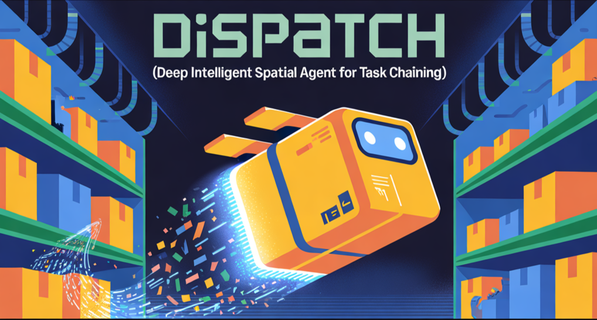
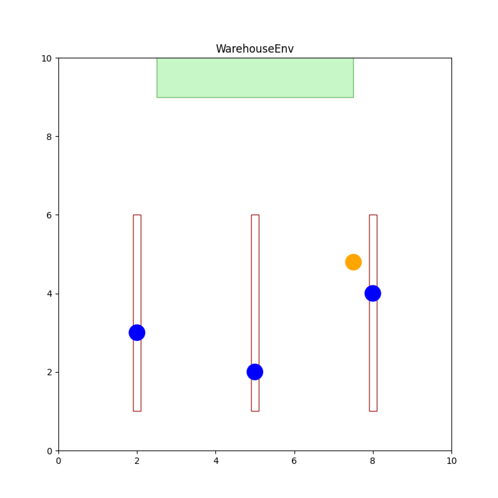
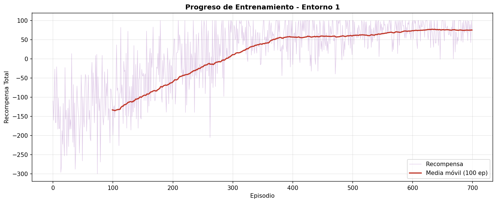
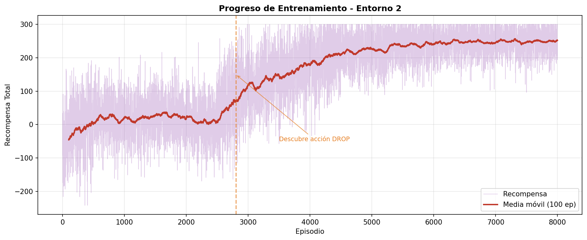
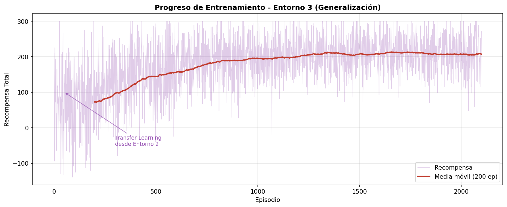

# DiSpAtCh 🤖📦

**DiSpAtCh** (*Deep Intelligent Spatial Agent for Task CHaining*) is a Deep Reinforcement Learning system that trains an autonomous agent to navigate a warehouse environment, pick up objects from shelves, and deliver them to a designated area.

This project was developed as part of the **Reinforcement Learning** course at **Universidad Pontificia Comillas, ICAI**, within the **Engineering Mathematics (iMAT)** program.

> 🎯 *From random wandering to efficient delivery – DiSpAtCh learns warehouse logistics through trial and error.*

---

## 📜 Table of Contents
- [📌 Project Overview](#-project-overview)
- [🎮 Environments](#-environments)
- [🛠️ Installation](#️-installation)
- [🚀 How to Use](#-how-to-use)
- [📂 Project Structure](#-project-structure)
- [📊 Results](#-results)
- [🧠 Technologies Used](#-technologies-used)
- [🙌 Credits](#-credits)

---

## 📌 Project Overview

DiSpAtCh implements a **Double DQN (Deep Q-Network)** agent that learns to operate in a simulated warehouse environment. The agent must learn to:

1. **Navigate** around obstacles (shelves) without collisions
2. **Pick up** objects from fixed or random positions
3. **Deliver** objects to a designated green area

### 🧠 Key Features

- **Double DQN** with experience replay for stable learning
- **Prioritized Experience Replay** boosting positive experiences
- **Rich feature representation** (23 features) with obstacle proximity detection
- **Transfer Learning** between environments for faster convergence
- **Best model checkpointing** based on success rate during training
- **Early stopping** when target success rate is achieved

### 🏭 The Warehouse

<p align="center">
  
  <br><em>The Warehouse</em>
</p>

---

## 🎮 Environments

The project includes three environments of increasing difficulty:

| Environment | Objects | Objective | Actions | Difficulty |
|-------------|---------|-----------|---------|------------|
| **Entorno 1** | Fixed positions | Pick only | 5 (↑↓←→ pick) | ⭐ |
| **Entorno 2** | Fixed positions | Pick + Delivery | 6 (↑↓←→ pick drop) | ⭐⭐ |
| **Entorno 3** | Random positions | Pick + Delivery | 6 (↑↓←→ pick drop) | ⭐⭐⭐ |

### Reward Structure

| Event | Reward |
|-------|--------|
| Each step | -1 |
| Collision (wall/shelf) | -100 |
| Successful pick | +100 |
| Successful delivery | +200 |
| Drop outside area | -50 |
| Invalid action | -1 |

### Training Strategy

```
Entorno 1 (from scratch)
    ↓ Transfer Learning
Entorno 2 (5→6 actions, partial transfer)
    ↓ Transfer Learning  
Entorno 3 (full transfer, learns generalization)
```

---

## 🛠️ Installation

### Prerequisites
- Python 3.8+
- PyTorch (with CUDA support recommended)
- Gymnasium

### Setup

1. Clone the repository:
   ```bash
   git clone https://github.com/your-username/DiSpAtCh.git
   cd DiSpAtCh
   ```

2. Create a virtual environment (recommended):
   ```bash
   python -m venv venv
   source venv/bin/activate      # Linux/macOS
   .\venv\Scripts\activate       # Windows
   ```

3. Install dependencies:
   ```bash
   pip install -r requirements.txt
   ```

---

## 🚀 How to Use

### Training

Train agents on each environment sequentially:

```bash
cd src

# Train Environment 1 (required first)
python entrenar_entorno1.py

# Train Environment 2 (uses transfer learning from E1)
python entrenar_entorno2.py

# Train Environment 3 (uses transfer learning from E2)
python entrenar_entorno3.py
```

Or train all environments in sequence:

```bash
python entrenar_todos.py
```

The best model (by success rate) is automatically saved to `models/`.

### Evaluating Models

Run comprehensive evaluation with visualizations:

```bash
python evaluar_entornos.py
```

This generates multiple analysis graphs in `outputs/`.

### Visualizing an Agent

Watch a trained agent in action:

```bash
# Visualize Environment 1 (3 episodes by default)
python visualizar_agente.py 1

# Visualize Environment 2 with 5 episodes
python visualizar_agente.py 2 5

# Visualize Environment 3 with 10 episodes
python visualizar_agente.py 3 10
```

---

## 📂 Project Structure

```
DiSpAtCh/
│
├── README.md                    # This file
├── requirements.txt             # Python dependencies
│
├── src/                         # Source code
│   ├── almacen_env.py          # Warehouse environment (Gymnasium)
│   ├── representacion.py        # Feature extraction (23 features)
│   ├── agente_dqn.py           # DQN agent implementation
│   │
│   ├── entrenar_entorno1.py    # Training script for Environment 1
│   ├── entrenar_entorno2.py    # Training script for Environment 2
│   ├── entrenar_entorno3.py    # Training script for Environment 3
│   ├── entrenar_todos.py       # Train all environments sequentially
│   │
│   ├── evaluar_entornos.py     # Evaluation with graphs
│   └── visualizar_agente.py    # Real-time agent visualization
│
├── models/                      # Trained models
│   ├── entorno1_mejor.pth      # Best model for Environment 1
│   ├── entorno2_mejor.pth      # Best model for Environment 2
│   └── entorno3_mejor.pth      # Best model for Environment 3
│
└── outputs/                     # Training graphs and results
    ├── entorno1_training.png
    ├── entorno2_training.png
    ├── entorno3_training.png
    ├── grafico_comparacion_objetivos.png
    ├── grafico_histograma_pasos.png
    ├── grafico_resultados_pie.png
    ├── grafico_success_acumulado.png
    └── grafico_tabla_resumen.png
```

---

## 📊 Results

### Performance Summary

| Environment | Target | Success Rate | Collision Rate | Avg Reward |
|-------------|--------|--------------|----------------|------------|
| **Entorno 1** | ≥95% | **97.4%** ✅ | 1.2% | 82.5 |
| **Entorno 2** | ≥90% | **91.4%** ✅ | 3.1% | 228.3 |
| **Entorno 3** | ≥85% | **88.4%** ✅ | 4.2% | 215.7 |

### Training Progress

#### Environment 1: Pick Only
- **Episodes to converge:** ~700
- **Training time:** ~2.5 minutes
- **Key insight:** Rapid learning with epsilon decay

#### Environment 2: Pick + Delivery
- **Episodes to converge:** ~8000
- **Training time:** ~25 minutes
- **Key insight:** Discovers DROP action around episode 3000, then rapid improvement

#### Environment 3: Random Objects (Generalization)
- **Episodes to converge:** ~2100
- **Training time:** ~8 minutes
- **Key insight:** Transfer learning enables fast adaptation to random positions

### Training Curves

<p align="center">
  
  <br><em>Environment 1: Rapid convergence to optimal policy</em>
</p>

<p align="center">
  
  <br><em>Environment 2: Plateau until DROP action is discovered</em>
</p>

<p align="center">
  
  <br><em>Environment 3: Fast adaptation thanks to transfer learning</em>
</p>

---

## 🧠 Technologies Used

### Frameworks & Libraries

- **PyTorch** – Deep learning framework for DQN implementation
- **Gymnasium** – RL environment interface
- **NumPy** – Numerical computations
- **Matplotlib** – Training visualization and environment rendering

### RL Techniques

| Technique | Purpose |
|-----------|---------|
| **Double DQN** | Reduces overestimation bias in Q-learning |
| **Experience Replay** | Breaks correlation between consecutive samples |
| **Prioritized Replay** | Boosts learning from successful experiences |
| **Target Network** | Stabilizes training with periodic weight updates |
| **Epsilon-Greedy** | Balances exploration vs exploitation |
| **Transfer Learning** | Accelerates training on harder environments |
| **Early Stopping** | Prevents overfitting when target is reached |

### Neural Network Architecture

```
Input (23 features)
    ↓
Linear(23 → 128) + ReLU
    ↓
Linear(128 → 64) + ReLU
    ↓
Linear(64 → num_actions)
    ↓
Output (Q-values)
```

### Feature Engineering (23 features)

| Features | Count | Description |
|----------|-------|-------------|
| Agent position | 2 | Normalized (x, y) |
| Has object flag | 1 | Binary |
| Distance to objects | 3 | Normalized distances |
| Closest object distance | 1 | Minimum distance |
| Direction to closest | 2 | Unit vector |
| Distance to delivery | 1 | Normalized |
| Direction to delivery | 2 | Unit vector |
| Relative positions | 6 | Objects relative to agent |
| **Obstacle proximity** | 4 | Distance to obstacles in 4 directions |
| Can pick flag | 1 | Binary (close enough to pick) |

---

## 🙌 Credits

This project was developed as part of the **Reinforcement Learning** course at **Universidad Pontificia Comillas, ICAI**.

### Team Members

- **Beltrán Sánchez Careaga**
- **Jorge Kindelan Navarro**
- **Ignacio Queipo de Llano Pérez-Gascón**

### Acknowledgments

- Our professors for their guidance throughout the course
- The **PyTorch** and **Gymnasium** communities for excellent documentation

---

## 📄 License

This project is for educational purposes as part of the iMAT program at ICAI.
