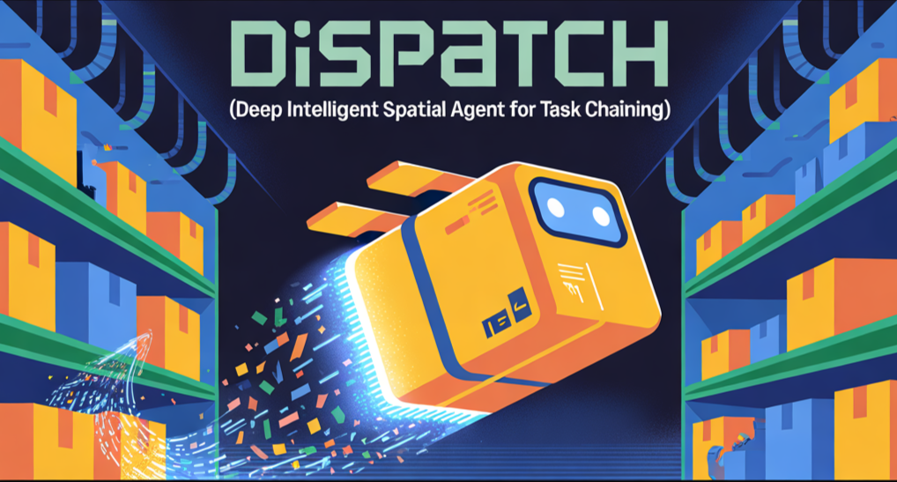
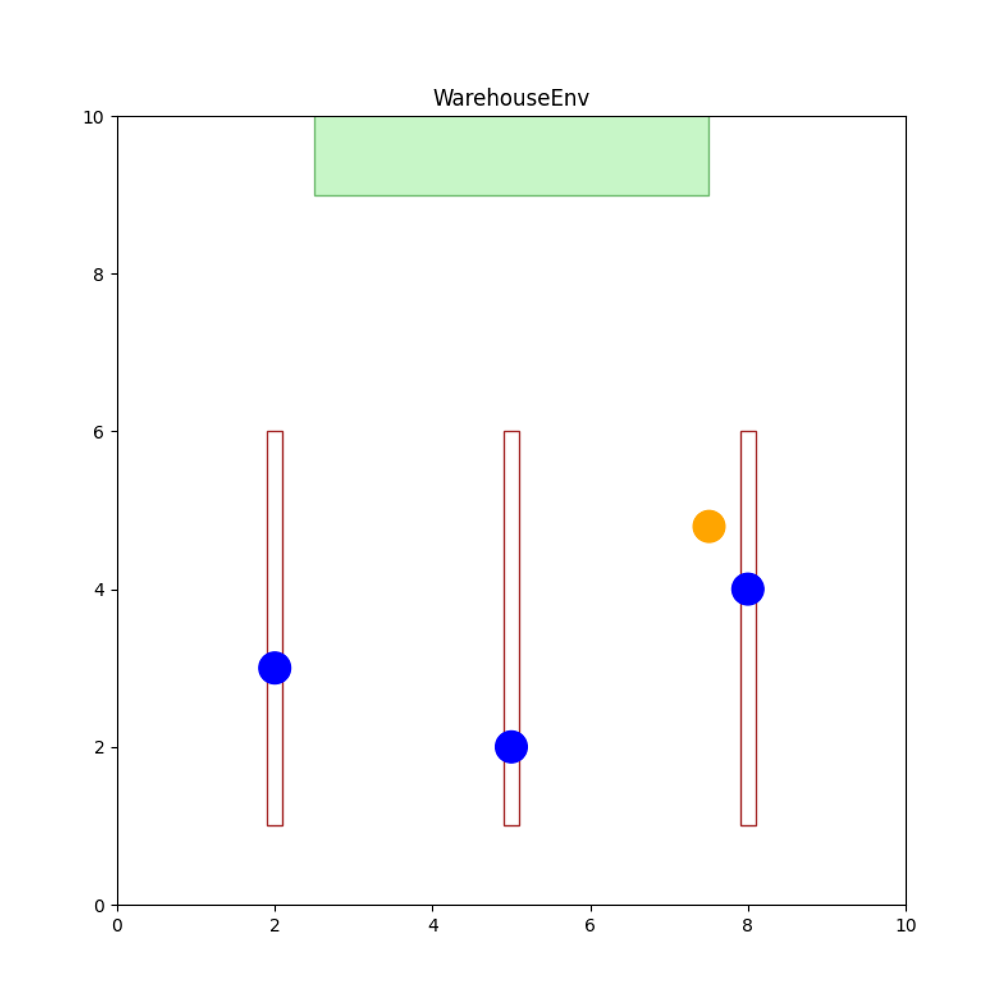
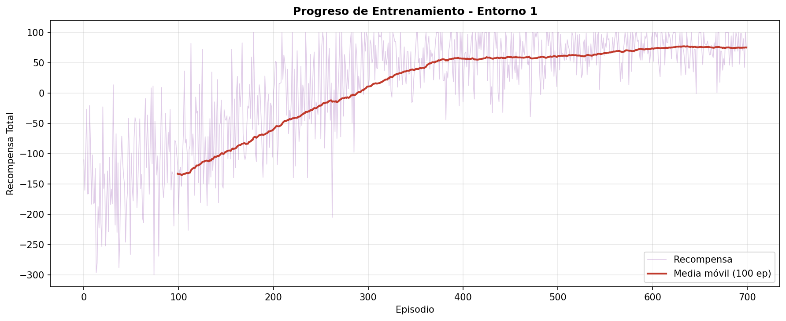
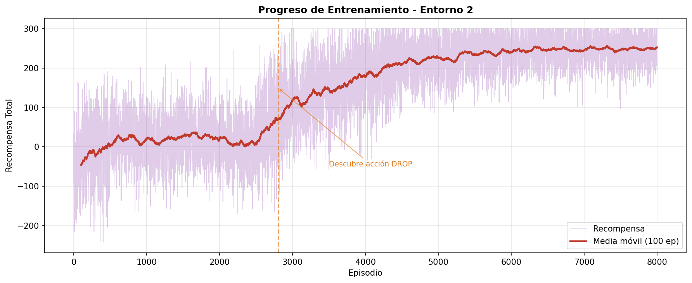
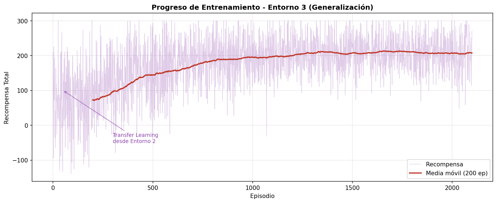

# DiSpAtCh

**DiSpAtCh** (Deep Intelligent Spatial Agent for Task CHaining) is a deep reinforcement learning system that trains an autonomous agent to navigate a warehouse, pick up objects from shelves, and deliver them to a designated area. The agent is a Double DQN implemented in PyTorch, trained across three environments of increasing difficulty with transfer learning between them.

Developed for the Reinforcement Learning course at Universidad Pontificia Comillas (ICAI), Mathematical Engineering and Artificial Intelligence (iMAT) program.

---

## Overview

The agent must learn to:

1. **Navigate** around obstacles (shelves) without collisions
2. **Pick up** objects from fixed or random positions
3. **Deliver** objects to a designated green area

Key components:

- **Double DQN** (PyTorch) with experience replay for stable learning
- **Prioritized replay** that oversamples successful experiences
- **Rich state representation**: 23 engineered features including obstacle proximity in four directions
- **Transfer learning** between environments for faster convergence
- **Best-model checkpointing** based on success rate during training
- **Early stopping** when the target success rate is reached

<p align="center">
  
  <br><em>The warehouse environment</em>
</p>

## Environments

Three environments of increasing difficulty:

| Environment | Objects | Objective | Actions | Difficulty |
|-------------|---------|-----------|---------|------------|
| **Entorno 1** | Fixed positions | Pick only | 5 (move x4, pick) | Basic |
| **Entorno 2** | Fixed positions | Pick + delivery | 6 (move x4, pick, drop) | Intermediate |
| **Entorno 3** | Random positions | Pick + delivery | 6 (move x4, pick, drop) | Advanced |

### Reward structure

| Event | Reward |
|-------|--------|
| Each step | -1 |
| Collision (wall or shelf) | -100 |
| Successful pick | +100 |
| Successful delivery | +200 |
| Drop outside area | -50 |
| Invalid action | -1 |

### Training strategy

```
Entorno 1 (from scratch)
    -> transfer learning
Entorno 2 (5 to 6 actions, partial transfer)
    -> transfer learning
Entorno 3 (full transfer, learns generalization)
```

## How to run

Prerequisites: Python 3.8+, PyTorch (CUDA recommended), Gymnasium.

```bash
git clone https://github.com/iqueipopg/DiSpAtCh.git
cd DiSpAtCh
python -m venv venv
source venv/bin/activate      # Windows: venv\Scripts\activate
pip install -r requirements.txt
```

### Training

```bash
cd src
python entrenar_entorno1.py   # Environment 1 (required first)
python entrenar_entorno2.py   # Environment 2 (transfer from E1)
python entrenar_entorno3.py   # Environment 3 (transfer from E2)
# or all in sequence:
python entrenar_todos.py
```

The best model by success rate is saved automatically to `models/`.

### Evaluation and visualization

```bash
python evaluar_entornos.py       # evaluation with analysis graphs in outputs/
python visualizar_agente.py 1    # watch a trained agent (env 1, 3 episodes)
python visualizar_agente.py 3 10 # env 3, 10 episodes
```

## Project structure

```
DiSpAtCh/
├── README.md
├── requirements.txt
├── src/
│   ├── almacen_env.py           # Warehouse environment (Gymnasium)
│   ├── representacion.py        # Feature extraction (23 features)
│   ├── agente_dqn.py            # Double DQN agent
│   ├── entrenar_entorno1.py     # Training script, environment 1
│   ├── entrenar_entorno2.py     # Training script, environment 2
│   ├── entrenar_entorno3.py     # Training script, environment 3
│   ├── entrenar_todos.py        # Train all environments sequentially
│   ├── evaluar_entornos.py      # Evaluation with graphs
│   └── visualizar_agente.py     # Real-time agent visualization
├── models/                      # Best model per environment (.pth)
└── outputs/                     # Training graphs and results
```

## Results

### Performance summary

| Environment | Target | Success rate | Collision rate | Avg reward |
|-------------|--------|--------------|----------------|------------|
| **Entorno 1** | 95% or higher | **97.4%** | 1.2% | 82.5 |
| **Entorno 2** | 90% or higher | **91.4%** | 3.1% | 228.3 |
| **Entorno 3** | 85% or higher | **88.4%** | 4.2% | 215.7 |

### Training progress

- **Environment 1 (pick only)**: converges in about 700 episodes (about 2.5 minutes). Rapid learning with epsilon decay.
- **Environment 2 (pick + delivery)**: converges in about 8000 episodes (about 25 minutes). The agent discovers the DROP action around episode 3000, then improves rapidly.
- **Environment 3 (random objects)**: converges in about 2100 episodes (about 8 minutes). Transfer learning enables fast adaptation to random positions.

<p align="center">
  
  <br><em>Environment 1: rapid convergence to an effective policy</em>
</p>

<p align="center">
  
  <br><em>Environment 2: plateau until the DROP action is discovered</em>
</p>

<p align="center">
  
  <br><em>Environment 3: fast adaptation thanks to transfer learning</em>
</p>

## Technical details

### Neural network architecture

```
Input (23 features)
    -> Linear(23, 128) + ReLU
    -> Linear(128, 64) + ReLU
    -> Linear(64, num_actions)
    -> Q-values
```

### RL techniques

| Technique | Purpose |
|-----------|---------|
| Double DQN | Reduces overestimation bias in Q-learning |
| Experience replay | Breaks correlation between consecutive samples |
| Prioritized replay | Boosts learning from successful experiences |
| Target network | Stabilizes training with periodic weight updates |
| Epsilon-greedy | Balances exploration and exploitation |
| Transfer learning | Accelerates training on harder environments |
| Early stopping | Ends training when the target success rate is reached |

### Feature engineering (23 features)

| Features | Count | Description |
|----------|-------|-------------|
| Agent position | 2 | Normalized (x, y) |
| Has-object flag | 1 | Binary |
| Distance to objects | 3 | Normalized distances |
| Closest object distance | 1 | Minimum distance |
| Direction to closest | 2 | Unit vector |
| Distance to delivery | 1 | Normalized |
| Direction to delivery | 2 | Unit vector |
| Relative positions | 6 | Objects relative to agent |
| Obstacle proximity | 4 | Distance to obstacles in four directions |
| Can-pick flag | 1 | Binary (close enough to pick) |

## Technologies

- **PyTorch**: deep learning framework for the DQN implementation
- **Gymnasium**: RL environment interface
- **NumPy**: numerical computations
- **Matplotlib**: training visualization and environment rendering

## Credits

Developed by **Beltrán Sánchez Careaga**, **Jorge Kindelan Navarro** and **Ignacio Queipo de Llano Pérez-Gascón**.

Thanks to our professors for their guidance, and to the PyTorch and Gymnasium communities for their documentation.
